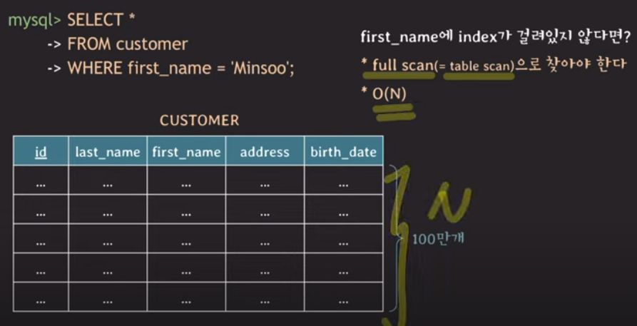
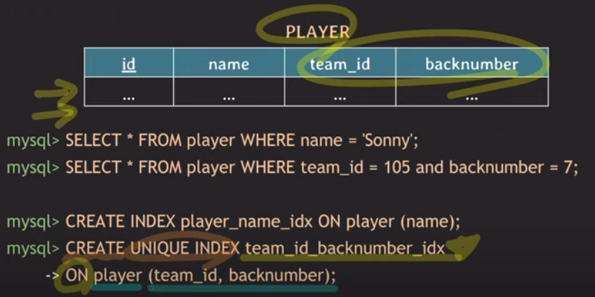
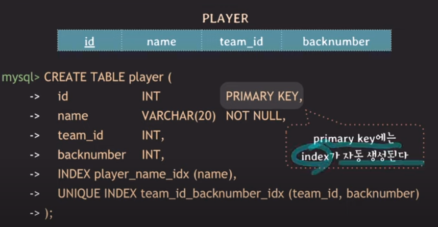
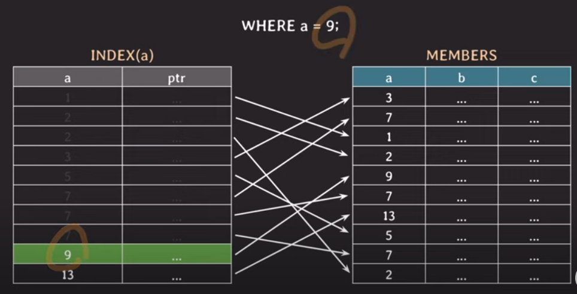
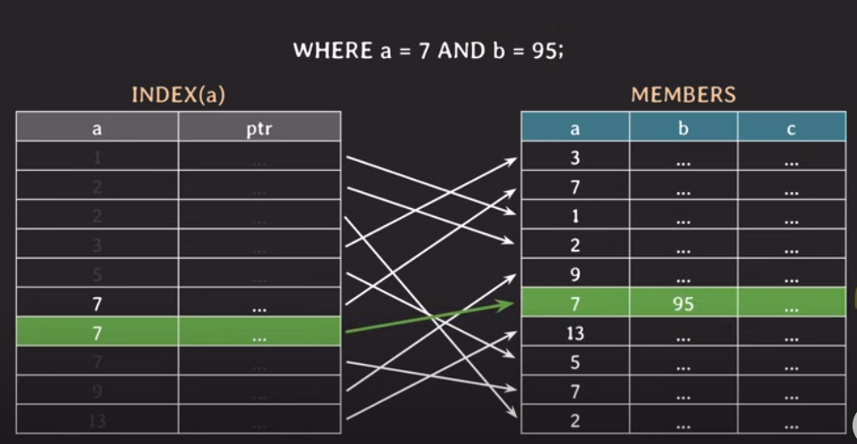
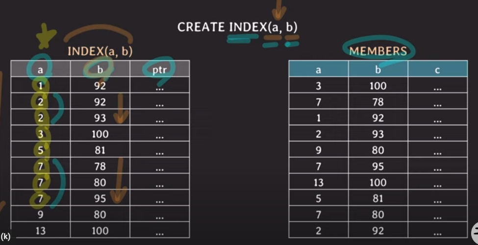
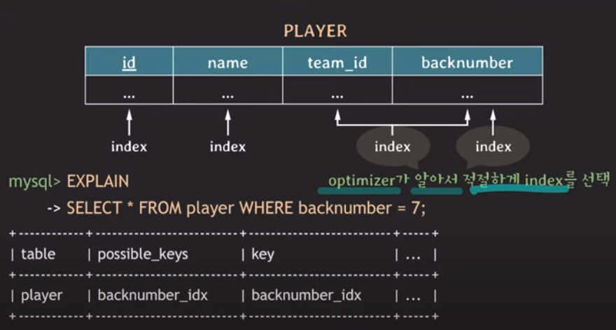
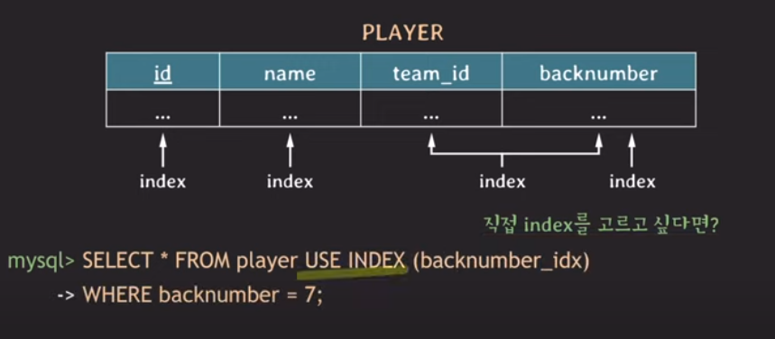
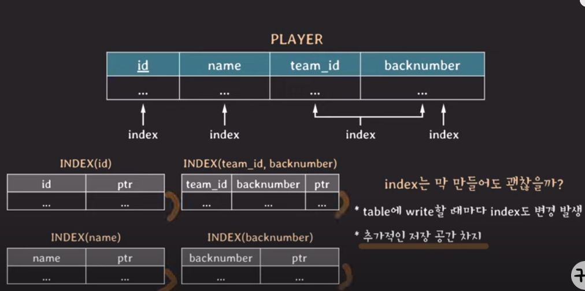

## DB Index(MySQL기반)

- 위 그림에서 보다시피, 인덱스를 사용하지 않는다면, first_name이 "Minsoo"인 사람들을 full scan하여서 결과값을 추출해야한다.
- first_name에 index가 걸려있었다면?
  - full scan이 아닌 **O(logN) (B-tree based index)의 시간이 소요될 수 있다.**
  - 즉, B-tree기반의 인덱스라면 O(logN)의 시간이 소요될 수 있다.
  - 따라서, index를 사용하는 이유를 아래와 같이 정의할 수 있다.

### Index를 쓰는 이유
- 조건을 만족하는 튜플들을 빠르게 조회하기 위해!

- 위 그림은, index에 대한 쿼리문을 작성한 것이다.
- 첫번째 쿼리문은, **name attribute가 중복을 허용하기때문에** UNIQUE INDEX가 아닌 **INDEX키워드를 사용하였다.**
- 두번째 쿼리문은, **team_id와 backnumber, 두 개의 attribute**를 가지고 INDEX를 만드는 쿼리문으로, **두 속성을 이용하면 팀 내의 고유한 팀원이 지정되기 때문에 UNIQUE INDEX키워드를 사용**하였다.

- 위 그림은, table을 create시에 특정 attribute에 index를 함께 걸어주는 쿼리문을 보여준 것이다.
- 추가로, **mysql에서는 pk에 index를 자동으로 생성해준다.**
- mysql에서 **특정 table에 대해 index를 확인하는 쿼리문**은 아래와 같다.
  - **SHOW INDEX FROM player;**

- a라는 attribute에 index가 걸려있었다고 가정하자.
- 왼쪽 그림에서의 첫번째 열은, a 속성에 대해 정렬한 값을 가지고 있고, 두번째 속성은 members의 a속성의 값의 pointer를 가지고 있다.
- where a = 9;가 되어있을때, 왼쪽 그림의 a속성은 정렬된 것으로, **9를 찾기 위해 BinarySearch를 하게 된다.**

- a라는 attribute에만 index가 걸려있을때, where문은 위처럼 두개의 속성(a=7 and b=95)을 찾는다고 가정해보자.
- 위에서 본 그림처럼, a가 7인 것을 찾기 위해서 Binary-Search를 하게 되는데, 위 그림과 다른 점은,
- **a속성이 7이 여러개 였다고 가정하면, 그에 해당하는 b의 값이 95임이 만족하는지를 확인하게 된다.**
- **이 상황 자체가 n개 있었다고 한다면, b가 95임을 만족하는 지를 n번(full scan) 확인해야할 것이다.**
- 따라서, 위 상황을 개선하기 위해, **a와 b를 하나로 묶은 인덱스가 필요하게 된다.**

- CREATE INDEX(a,b)와 같이 두 속성에 대해 하나로 묶은 인덱스를 만들었다.
- (a, b)로 순서를 지정하였기에, a가 먼저 정렬된뒤, a가 같다면, b에 대해서 정렬이 되는 형식이다.
- where a = 7 and b = 95일때, a에 대해서 BinarySearch를 하게 되고, 그에 따라 b를 찾게 된다.
- where b = 95일땐, 두개로 묶은 인덱스를 사용해봤자 더 좋은 성능을 얻을 수 없다.
- 따라서, where b = 95 조건일땐, b만 적용한 인덱스가 필요한 것이다.

### 즉, 사용되는 Query에 맞춰서 적절하게 index를 걸어줘야 query가 빠르게 처리될 수 있다.

- team_id, backnumber 두개의 속성을 적용한 index가 있고, backnumber만 적용된 index가 있다고 하였을때, 
- EXPLAIN키워드를 통해 DBMS의 optimizer가 적절하게 index를 선택하여 backnumber만 적용한 index를 이용하여 더 빠르게 처리될 수 있도록 한다.

- 직접 index를 고르고 싶을때는, USE INDEX키워드를 사용한다. (optimizer에게 권장)
- 완전 강하게 index를 선택하고 싶을때, FORCE INDEX키워드를 사용한다.

## Index를 남발하게 사용한다면?

- table에 특정 값을 write할때마다, index변경이 발생한다.
- index를 저장하기 위한 table의 추가적인 저장공간이 별도로 필요해진다.
- 따라서, 불필요한 index는 사용하지 않는 것이 좋다.

### Hash index
- hash table을 이용해서 index를 구현
- 시간복잡도 o(1)
- rehashing에 대한 부담
- = 비교만 가능, range비교 불가능
- multicolumn index의 경우, 전체 attributes에 대한 조회만 가능

### index보다 full scan이 더 좋은 경우
- table에 데이터가 조금 있을때
- **데이터가 테이블의 상당 부분을 차지할때!**

