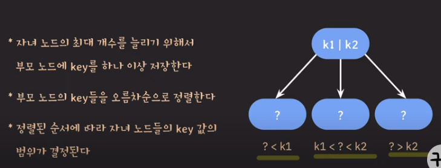
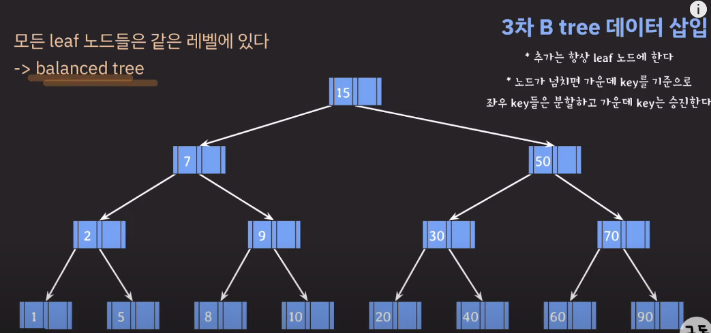

## BST(이진탐색트리)
- 모든 노드의 왼쪽 서브트리는 해당 노드의 값보다 작은 값들만 가지고, 모든 노드의 오른쪽 서브트리는 해당 노드의 값보다 큰 값들만 가진다.
- 자녀 노드는 최대 두개까지

## BTree

- 위 방식을 사용하면, **자녀 노드의 최대 개수를 입맛에 맞게 결정해서 쓸 수 있다.**
- 따라서, B tree는 BST를 일반화한 tree라고도 말한다.

- 모든 leaf노드들은 같은 레벨에 있기 때문에 balanced tree라고 한다.
- 검색에 대한 평균/최악의 시간복잡도 O(logN)
- 참고로, BST는 한쪽으로 치우지는 쏠림 현상이 발생하여 balanced tree라고 하지 않는다.
  - BST는 worst의 시간복잡도 O(N)

