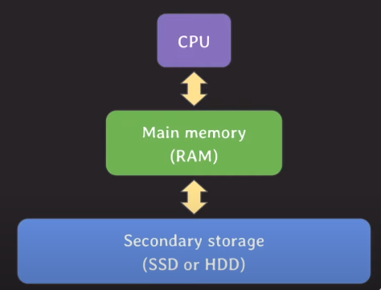

## 인덱스로 BTree계열이 자주 사용되는 이유

### BTree, AVL Tree, Red-Black-Tree 시간복잡도

- BTree 
  - Binary Search Tree(BST)를 일반화한 트리

- Self-Balancing BST
  - BST중에서 한쪽으로 치우치는 것이 있는데, 이를 보완하기 위해 스스로 규형을 잡는 트리인 AVL트리, RedBlackTree가 있다.

- 세개 모두 시간복잡도가 O(logN)인데 왜 굳이 BTree를 DB INDEX로 자주 쓰일까?

---

위를 이해하기 앞서, computer system을 이해할 필요가 있다.

## computer system

computer system에는 총 3가지로 나눠서 설명할 수 있다.

- cpu
  - 프로그램 코드가 실제로 실행되는 곳
- main memory(RAM)
  - 실행 중인 프로그램의 코드들과 코드 실행에 필요한 혹은 그 결과로 나온 데이터들이 상주하는 곳
  - 휘발성
- Secondary storage(SSD or HDD)
  - 프로그램과 데이터가 영구적으로 저장되는 곳으로 **실행중인 프로그램의 데이터 일부가 임시 저장되는 곳**이다.
  - 비휘발성
  - 데이터를 처리하는 속도가 가장 느리다
  - 데이터를 저장하는 용량이 가장 크다
  - block 단위로 데이터를 읽고 쓴다
    - 단점 : 불필요한 데이터까지 읽어올 가능성이 있다.

- Secondary Stoarge에서 **실행중인 프로그램의 데이터 일부가 임시 저장되는 곳**이라는 것은 어떤 것을 의미할까?
- 어떤 프로그램에서 실행되어야할 데이터가 엄청 많다면 RAM메모리에 모두 저장할 수 없다. 왜냐하면 RAM메모리는 용량이 작기 때문!
- 따라서, 잘 실행되지 않는 데이터는 임시로 Secondary storage에 저장할 수 있다. 
- 실행중인 프로그램의 데이터 일부가 임시 저장된다는 것은, 위 상황을 의미하는 것이다.

---

## database

- DB는 secondary storage에 저장된다.
- DB에서 데이터를 조회할 때, secondary storage에 최대한 적게 접근하는 것이 성능면에서 좋다.
- block단위로 읽고 쓰기 때문에 연관된 데이터를 최대한 모아서 저장하면 더 효율적으로 읽고 쓸 수 있다.

---

## AVL Tree기반의 index와 B Tree기반의 index를 비교해보자.

- tree의 각 노드는 서로 다른 block에 있다고 가정하자
- 초기에는 root 노드를 제외한 모든 노드는 secondary storage에 있다고 가정하자.
- 초기에는 데이터 자체도 secondary storage에 있다고 가정하자.

b가 5인 데이터를 조회해해보자.

- b가 5인 데이터를 조회하기 위해 AVL tree는 secondary storage를 총 4번 접근하였다.

- b가 5인 데이터를 조회하기 위해 B tree는 secondary storage를 총 2번 접근하였다. 

- 위와 같은 현상이 발생하는 이유는, 
  - AVL tree는 자녀노드의 수가 2개이기때문!, B tree는 자녀노드의 수를 2개 이상 가질 수 있다!
    - 이로인해, **B tree는 AVL tree에 비해 데이터를 찾을 때의 탐색 범위를 빠르게 좁힐 수 있다.**
  - AVL tree는 노드의 데이터를 1개만 저장하지만, B tree는 노드의 데이터를 2개 이상 가질 수 있다! 
    - 따라서 **B tree는 AVL tree에 비해 block단위에 대한 저장공간 활용도가 더 좋다.**

## 101차 B tree의 avg case와 worst case

- worst case일 때, 약 26만건의 데이터를 저장할 수 있다.
- avg case일때, 약 1억건의 데이터를 저장할 수 있다.

- 따라서, **네 개의 level만으로 수백만, 수천만 개의 데이터를 저장할 수 있다**는 뜻!
- 즉, root노드에서 가장 멀리 있는 데이터도 세 번만의 이동만으로 접근 가능하다.

## Btree를 index로 사용하는 이유(최종)
- B tree index는 self-balancing BST에 비해 secondary storage접근을 적게 한다.
- B tree 노드는 block단위의 저장공간을 알차게 활용할 수 있다.

## hash index(추가)
- hash index는 삽입/삭제/조회의 시간복잡도가 O(1)이지만, equality(=)조회만 가능하다.
- 범위 기반 검색이나 정렬에는 사용될 수 없다.

- 따라서, equality조회만 가능하다는 것이 보장이 된다면, hash index를 쓰는 것이 좋지만, 이런 경우는 매우 드물기에 일반적으로 Btree로 index를 활용한다!

  

